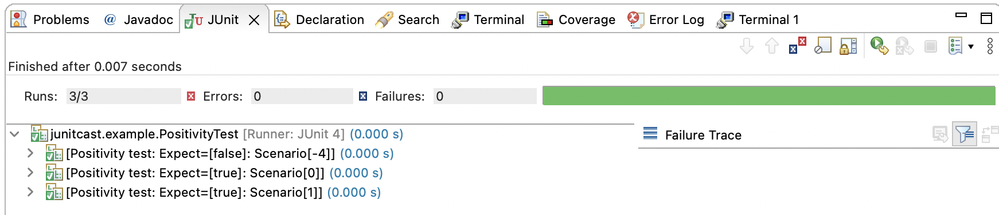

## Creating a Unit Test

To illustrate, consider a class that verifies the positivity or negativity of a 
number. The initial step entails establishing the parameters for the unit test 
by creating a properties file. This file should contain the test description and 
the corresponding inputs. It is advisable to select inputs that are concise yet 
comprehensive, encompassing all conceivable scenarios that necessitate testing.

```properties
casedesc0=Positivity test

# In the interest of simplification, we will focus solely on fundamental 
# scenarios.
var0=-4, 0, 1
```

Once we have determined our inputs, it is essential to define the buckets that 
represent the potential outcomes of these inputs. To keep things simple, we can 
consider two outcomes: **true** and **false**. These buckets are distinguished 
by the tilde character, and within each bucket, we must include all the possible 
combinations of our inputs. Fortunately, in our case, the input is 
one-dimensional, meaning that each input can only be assigned to one bucket. 
Therefore, in the same property file, we can allocate the value **-4** to the 
false bucket, and the values **0** and **1** to the **true** bucket.

```properties
rule0=\
false:1|4|5551\
~true:2|3|5|3331
```

The buckets are delimited by the tilde character, and the basic logical 
operators **|** for **OR**, **&** for **AND**, and **!** for **NOT** are 
employed. You can also use the parenthesis characters to influence the 
precedence. In this 1-dimensional example, each input is allocated to a single 
bucket.

This bucket system possesses self-validation capabilities, meaning that an input 
not assigned to any bucket will result in an error. Furthermore, attempting to 
assign the same input to multiple buckets will also trigger an error, as it is 
physically impossible. To illustrate, envision Popsicle sticks representing the 
input, where each stick must be placed in a bucket, ensuring that each bucket 
contains at least one stick.


With the parameters and rules now established, we can proceed to create the JUnit 
test java file, which will determine the behavior of our subject in accordance 
with these parameters.

1. Create a new JUnit test file from the [template](./src/main/resources/templateTest.tpl)
and update with the necessary type arguments.

2. Set our subject by instantiating inside `setupTargetObject`

```java
   setMockSubject(new Positivity());
```

3.  Connect our properties file so we can generate the inputs and know about the rules.

```java
return new ParameterGenerator<Integer>().genVarData("junitcast.example.PrimeNumberTest");
```

4.  Inside our **prepare** method, we can go through all the possible scenarios. 
Let's store each token into a temporary location so that we can access those inside the execution method:

```java
for (final Integer scenarioToken : getParameter().getScenario()) {
    setTransientValue(0, scenarioToken);
}
```

5.  Then inside our **execution** method, we set the result by executing our 
subject's `isPositive()` method, passing in the input we stored from step 3.

```java
setResult(String.valueOf(getMockSubject().isPositive(getTransientValue(0))));
```

That concludes the setup process. We shall now proceed to execute the test and 
observe the output:




See [](./src/main/test/java/junitcast/example) for more examples.
